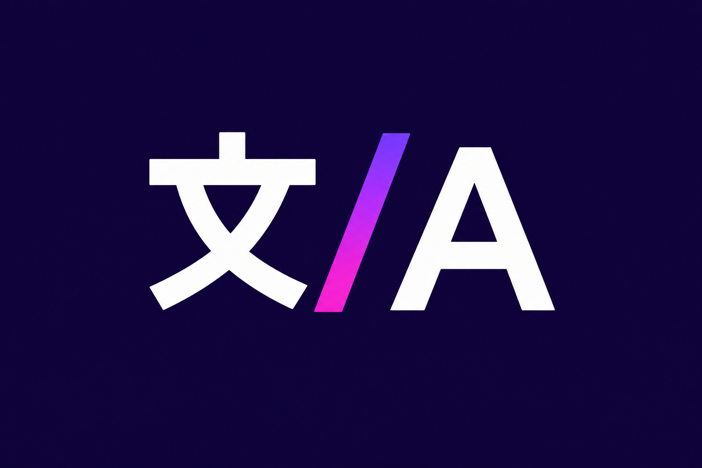

# CJK Name Fixer



**CJK Name Fixer** est un plugin Jellyfin qui remplace les noms de personnes écrits en caractères chinois, japonais ou coréens par leur nom latin correspondant sur TMDb. Il est conçu pour corriger les noms d’acteurs et d’autres personnes associés aux médias de la bibliothèque.

## Fonctionnalités

- Lance une analyse des fiches de personnes existantes depuis les tâches planifiées de Jellyfin.
- Peut traiter les personnes liées à un nouveau film, épisode ou élément de série lorsqu’il est ajouté à la bibliothèque.
- Ne modifie un nom que si une correspondance TMDb est disponible et que le champ n’est pas verrouillé.
- Met à jour les crédits des médias associés en même temps que le nom pour conserver les liens vers la fiche Person.
- Met en cache les résultats TMDb, y compris les recherches sans correspondance, pendant 12 heures.
- Réutilise par défaut le client TMDb de Jellyfin. Une clé API TMDb personnelle peut être configurée pour utiliser son propre quota.
- Permet de régler le délai entre les requêtes TMDb afin de limiter leur fréquence.

Le plugin ne lance pas de vérification périodique. L’analyse d’une bibliothèque existante est déclenchée manuellement; le traitement des nouveaux médias est activé par défaut et peut être désactivé dans les paramètres.

## Installation

Dans Jellyfin, ouvre **Tableau de bord → Plugins → Dépôts**, puis ajoute le manifeste du dépôt :

```text
https://raw.githubusercontent.com/ShamanTramp/CJK-Name-Fixer/main/manifest.json
```

Enregistre le dépôt, ouvre le catalogue des plugins, sélectionne **Disponible** si nécessaire, puis installe **CJK Name Fixer**. Redémarre Jellyfin lorsque l’installation est terminée. Le plugin peut aussi être téléchargé depuis [GitHub Releases](https://github.com/ShamanTramp/CJK-Name-Fixer/releases).

Pour mettre à jour le dépôt, Jellyfin doit pouvoir accéder au manifeste et aux fichiers de release sur GitHub.

## Configuration et utilisation

Dans **Tableau de bord → Plugins → CJK Name Fixer**, configure les options suivantes :

| Option | Valeur par défaut | Description |
| --- | --- | --- |
| Vérifier les noms à l’ajout | Activée | Traite les personnes associées aux nouveaux médias pris en charge. |
| Délai entre les requêtes TMDb | 500 ms | Définit le délai minimal entre les requêtes TMDb. |
| Clé API TMDb personnelle | Vide | Facultative. Si elle est renseignée, elle est utilisée à la place du client TMDb de Jellyfin. |

Pour analyser les médias déjà présents, lance **Fix CJK Person Names** depuis **Tableau de bord → Tâches planifiées**.


Les tests couvrent notamment la détection des caractères CJK, la résolution et la mise en cache des noms TMDb, ainsi que le traitement des personnes. Le fichier `compose.yaml` permet de démarrer une instance Jellyfin locale pour les essais d’intégration.

## Licence

GPL-3.0-only. Voir [LICENSE](LICENSE).
